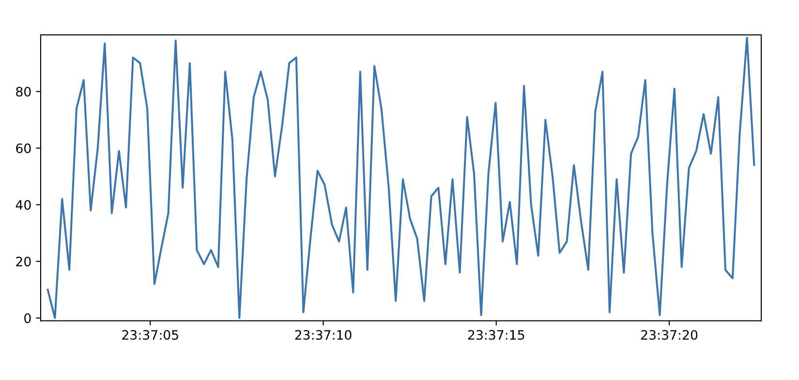

# Zeromq Example

This example is a basic Zeromq implementation with NiceGUI.

It shows how to stream data from a zeromq socket to a NiceGUI plot.

In order to do this, the zmq python library is used to create a publisher and a subscriber. The main interesting aspect is that the zmq.async library is used to create a subscriber that can be used in an asyncio loop, which is necessary to run the NiceGUI server.

## Running the example

There are two components to this example: the publisher and the NiceGUI server.

In addition to the normal nicegui dependancies, the zmq library must be installed (see requirements.txt).

### Running the publisher

The publisher is a simple python script that sends random data to a zeromq socket. To run it, simply execute the following command:

```bash
python zmq-server.py
```

### Running the NiceGUI server

The NiceGUI server is a python script that creates a plot and updates it with data from the zeromq socket. To run it, execute the following command:

```bash
python main.py
```

### Results

Once both the publisher and gui server are running, you will see an updating plot on the UI.


